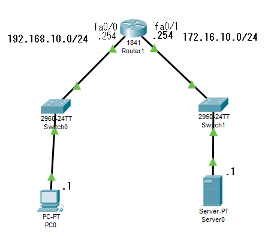
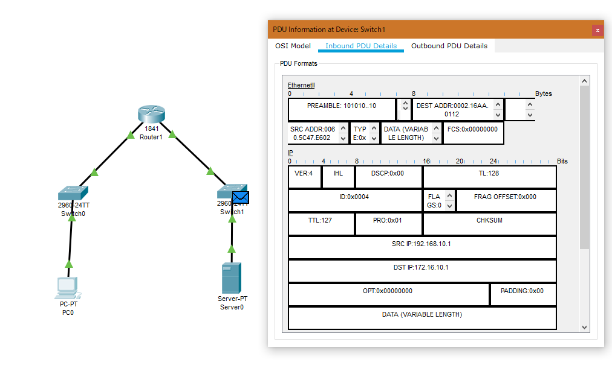
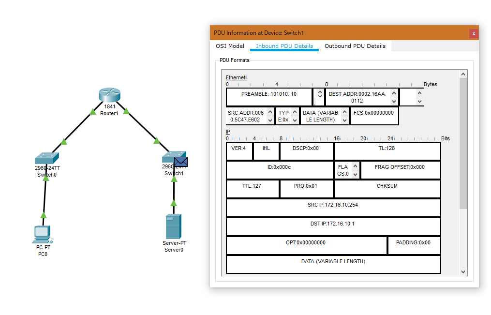

# Static NAT

- PacketTracer 7.2.0.0226

---

下図のようなトポロジで作成


PC0から`172.16.10.0/24`への通信で、送信元IPがRouter1になって通信を行うように設定します。

---

### Router1の設定
内部ローカルアドレスを外部ローカルアドレスを設定します。今回はPC0のIPアドレス`192.168.10.1`が内部ローカルアドレス、Rotuer1の`fa0/1`のIPアドレス`172.16.10.254`が外部ローカルアドレスとします。
```
Router(config)# ip nat inside source static 192.168.10.1 172.16.10.254
```

次に、どのインターフェースが内部ネットワークなのか、外部ネットワークなのかを指定します。
```
Router(config)# int fa0/0
Router(config-if)# ip nat inside
Router(config-if)# exit
Router(config)# int fa0/1
Router(config-if)# ip nat outside
Router(config-if)# exit
```

---

### 検証
PC0からServer0へpingを飛ばし、Router1を通過直後のパケットの送信元アドレスを確認します。
まずは、NATの設定を**していない**場合、下図のように`SRC IP: 192.168.10.1`となっています。



次に、NATの設定を**した**場合、下図のように`SRC IP: 172.16.10.254`となっています。

