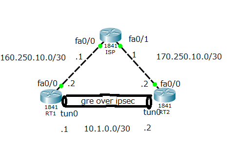

# GRE over IPSec

以下のようなトポロジで構築。

## 各機器について 
### ISP
|インターフェース名|IPアドレス|用途|
|:---|:---|:---|
|fa0/0|160.250.10.1/30|RT1と接続|
|fa0/1|170.250.10.1/30|RT2と接続|

`ISP.conf` : `ISP`で`show run`した結果

### RT1
|インターフェース名|IPアドレス|用途|
|:---|:---|:---|
|fa0/0|160.250.10.2/30|ISPと接続|
|fa0/1|-|未使用|
|tunnel0|10.1.0.1/30|RT2とのGREトンネルのインターフェース|

`RT1.conf` : `RT1`で`show run`した結果

### RT2
|インターフェース名|IPアドレス|用途|
|:---|:---|:---|
|fa0/0|170.250.10.2/30|ISPと接続|
|fa0/1|-|未使用|
|tunnel0|10.1.0.2/30|RT1とのGREトンネルのインターフェース|

`RT2.conf` : `RT2`で`show run`した結果

### できていないこと
- mtuやmssの設定